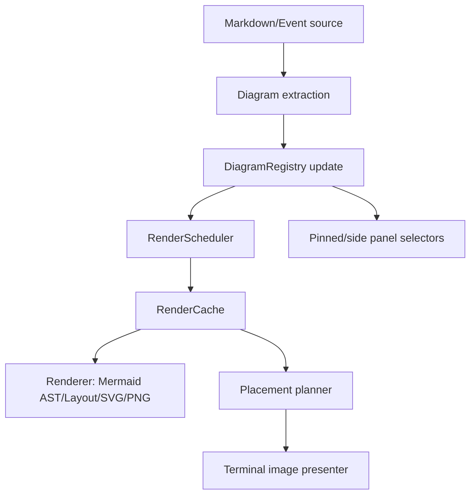

# ADR: Mermaid Rendering Redesign

Date: 2026-05-08
Status: Proposed

## Problem

The current Mermaid path is difficult to reason about because rendering, caching, UI placement, active diagram registration, deferred work, debug stats, and terminal image protocol state are coupled through global state and side effects.

Observed pain points:

- `jcode-tui-mermaid/src/lib.rs` is still a state hub despite the crate split.
- Markdown rendering decides Mermaid behavior directly, including streaming/deferred/side-only registration rules.
- Active diagrams are registered as a side effect of render calls, so simply preparing markdown mutates pinned-pane state.
- `with_preferred_aspect_ratio` uses thread-local state, so cache keys and render sizing depend on ambient context.
- The same diagram can be rendered in multiple contexts: chat inline placeholder, side panel image, pinned pane, streaming preview, debug probe. These contexts need different behavior but share low-level functions.
- Deferred rendering has its own dedupe/epoch/global queue and also performs active registration, increasing race risk.
- Image protocol rendering, PNG generation, image-state caches, and viewport rendering are mixed into the same public surface.

## Size API direction

The renderer now has an `mmdr-size-api` path guarded by the `mmdr-size-api` feature plus `JCODE_MMDR_SIZE_API_AVAILABLE=1`. That should become the primary path for the redesign:

- Renderer should ask Mermaid/layout for measured SVG/canvas dimensions instead of relying on source text complexity estimates for final PNG sizing.
- `calculate_render_size` should become a request target hint, not the source of truth for output dimensions.
- The fallback SVG-retargeting path should remain only as compatibility code until the patched renderer is always available.
- Debug stats should report `render_size_backend` and fail loudly in tests when the size API path is expected but unavailable.
- Cache keys should include normalized target/profile inputs, while artifacts should store measured output dimensions returned by the size API.

This reduces bugs from aspect-ratio retargeting, blurry upscaling, placeholder height mismatch, and pane resize oscillation.

## Target design

Use an explicit, staged pipeline with pure data between stages:



### 1. Diagram extraction

Markdown renderers should only extract fenced Mermaid blocks into immutable descriptors:

```rust
struct DiagramBlock {
    id: DiagramId,
    source_hash: u64,
    source: Arc<str>,
    origin: DiagramOrigin,
    ordinal: usize,
}
```

They should not directly mutate active diagrams or synchronously render unless a caller explicitly asks for a blocking fallback.

### 2. Explicit render request

Replace ambient `with_preferred_aspect_ratio` and boolean parameters with one request object:

```rust
struct RenderRequest {
    diagram_id: DiagramId,
    source_hash: u64,
    source: Arc<str>,
    target: RenderTarget,
    profile: RenderProfile,
    priority: RenderPriority,
    mode: RenderMode,
}

struct RenderProfile {
    width_cells: Option<u16>,
    preferred_aspect_per_mille: Option<u16>,
    theme: MermaidTheme,
}

enum RenderMode {
    CacheOnly,
    EnqueueIfMissing,
    Blocking,
}
```

Cache keys should be built only from `source_hash + normalized RenderProfile`, never from thread-local context.

### 3. Registry owns active state

Introduce a `DiagramRegistry` owned by TUI app/session state, not a global Mermaid crate vector.

Responsibilities:

- Track diagrams visible in the current prepared transcript/side panel.
- Track streaming preview separately with a generation id.
- Publish the ordered list for pinned pane selection.
- Clear/update atomically per prepare pass.

Rendering should return `RenderArtifact`; it should never register active diagrams as a side effect.

### 4. Scheduler owns async/deferred behavior

A scheduler receives explicit requests and returns one of:

```rust
enum RenderStatus {
    Ready(RenderArtifact),
    Pending { request_id: RenderRequestId },
    Failed(RenderError),
    ProtocolUnavailable,
}
```

Rules:

- Deduplication is by full cache key.
- Workers do not mutate active registry.
- Worker completion only publishes `MermaidRenderCompleted` plus artifact metadata.
- Epoch invalidation is scoped to request generations, not one global counter unless truly necessary.

### 5. Placement planner is separate from rendering

Markdown/side-panel preparation should insert placeholders based on `RenderStatus` and desired placement:

- Inline image placeholder lines for chat/side panel.
- Sidebar marker for side-only mode.
- Error block for failed render.
- Pending placeholder for deferred/streaming render.

Image widget rendering should consume `RenderArtifact` plus `PlacementPlan`, not know Mermaid source or render scheduling.

### 6. Public module boundaries

Recommended crate modules:

- `model.rs`: `DiagramId`, `DiagramBlock`, `RenderProfile`, `RenderTarget`, `RenderArtifact`, `RenderStatus`, errors.
- `extract.rs`: Markdown Mermaid block extraction helpers.
- `cache.rs`: disk and memory artifact metadata cache.
- `renderer.rs`: Mermaid parse/layout/SVG/PNG conversion only.
- `scheduler.rs`: request queue, worker, dedupe, completion events.
- `registry.rs`: active/streaming diagram state, ideally app-owned.
- `placement.rs`: placeholder/image-region planning.
- `presenter.rs`: ratatui-image/Kitty/Sixel/iTerm viewport rendering.
- `debug.rs`: stats collected from explicit events.

## Migration plan

1. Add explicit model types and cache key normalization tests.
2. Add a new scheduler API while keeping old wrappers.
3. Convert `render_mermaid_sized_internal` into pure-ish `renderer::render_to_png(request) -> RenderArtifact`.
4. Move active diagram writes out of render functions into markdown prepare/app registry updates.
5. Replace `with_preferred_aspect_ratio` call sites with explicit `RenderProfile` plumbing.
6. Split presenter/image-state code from PNG rendering code.
7. Delete old boolean wrapper APIs and thread-local render profile.

## Validation criteria

- Unit tests for cache key normalization and filename parsing.
- Unit tests for registry update ordering, streaming preview replacement, and atomic clear/update.
- Scheduler tests for dedupe, cache-hit, cache-miss pending, worker completion, and no active-state mutation.
- Markdown renderer tests that Mermaid blocks produce deterministic placeholders without global side effects.
- Existing scroll/pinned-pane tests still pass.
- A debug probe can render a diagram with explicit profile and report the exact cache key used.

## Near-term safe refactor

Before a full migration, the highest ROI change is to introduce explicit request/status types and make old public functions thin compatibility wrappers. That lets us migrate call sites one at a time while reducing new bugs from additional boolean/thread-local behavior.
